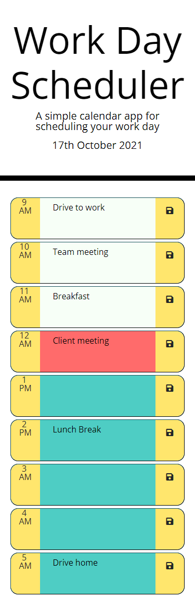

# Daily planner

A calendar application that allows users to save events for each business hour and manage their time effectively.

## User story

```md
AS AN employee with a busy schedule
I WANT to add important events to a daily planner
SO THAT I can manage my time effectively
```

## Description

For this job task I created a daily planner application which would allow users to save events for each business hour (9AM to 5PM) a using HTML, CSS and JavaScript.

## Link live application

Click [here](https://lianavaleria15.github.io/daily-planner/) to view the live deployed application.

## Technology used

### HTML5

- created application boilerplate
- linked CSS and Bootstrap stylesheets
- linked JavaScript and Jquery

### CSS3

- added color variables
- added color class properties for each time block
- added media query properties for small devices

### CSS Bootstrap

- used grid template to build each time block and `d-flex` class to add responsiveness to design

### JavaScript

- used local storage to save data introduced by user's in textarea on each row

### JQuery

- used template strings to create the time blocks
- DOM manipulation
- add events on save button

## Screenshots

### Desktop viewport


### Mobile viewport


